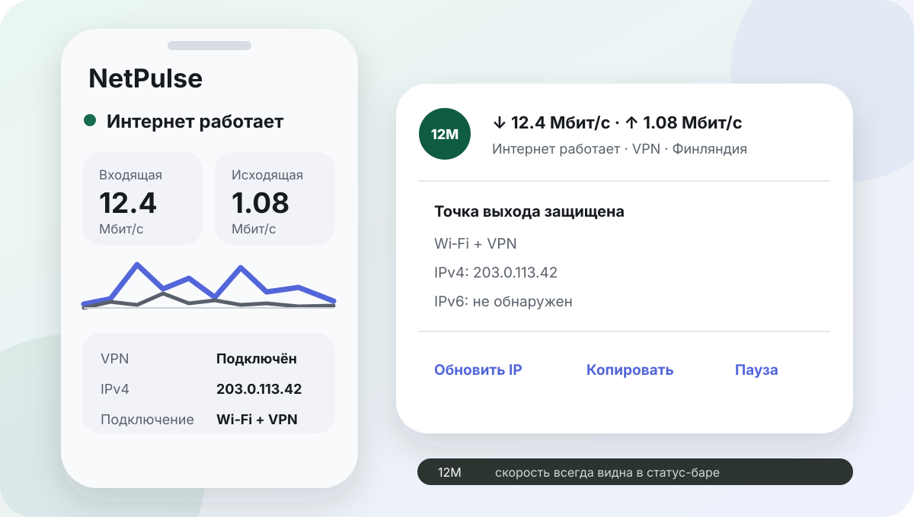

<p align="center">
  
</p>

<h1 align="center">NetPulse</h1>

<p align="center">
  Сетевой пульс Android: скорость, доступ в интернет, VPN и публичный IP.
</p>

<p align="center">
  <a href="https://github.com/yavasilek/netpulse/releases/latest"></a>
  <a href="https://github.com/yavasilek/netpulse/actions/workflows/ci.yml"></a>
  <a href="LICENSE"></a>
</p>

Нативный Android-индикатор скорости, состояния интернета, VPN и публичного IP.



NetPulse аккуратно держит полезную сетевую информацию под рукой:

- входящая и исходящая скорость в закреплённом уведомлении;
- компактная динамическая скорость в статус-баре;
- подтверждённый Android статус доступа в интернет;
- VPN поверх Wi‑Fi или мобильной сети;
- публичные IPv4 и IPv6, страна и оператор выходного узла;
- предупреждение при отключении VPN или смене IP;
- безопасное обновление через GitHub Releases.

## Скачать

Готовый APK находится в [GitHub Releases](https://github.com/yavasilek/netpulse/releases/latest).
Android попросит разрешить установку из браузера или файлового менеджера.
Последующие версии NetPulse проверяет и предлагает сам.

## Как приложение понимает сеть

- Для скорости используются системные счётчики активного сетевого интерфейса.
- При двух SIM учитывается SIM, по которой Android в данный момент направляет интернет-трафик.
- VPN определяется по активному VPN-маршруту Android поверх Wi‑Fi или мобильной сети.
- Реальный внешний результат маршрутизации подтверждается отдельными запросами IPv4/IPv6.
- VPN или прокси на роутере, компьютере либо внешнем шлюзе не виден Android как VPN,
  но его выходной IP и страна всё равно отображаются.

## Технологии

- Kotlin 2.3;
- Jetpack Compose и Material 3;
- Coroutines и Flow;
- foreground service для видимого пользователю мониторинга;
- DataStore и WorkManager;
- GitHub Actions для тестов и подписанных релизов.

Минимальная версия: Android 8.0 (API 26). Целевая версия: Android 16 (API 36).

## Сборка

1. Установите Android Studio и Android SDK 36.
2. Скопируйте `local.properties.example` в `local.properties` и укажите путь к SDK.
3. Выполните:

```bash
./gradlew testDebugUnitTest lintDebug assembleDebug
```

Debug APK появится в `app/build/outputs/apk/debug/`.

## Приватность

NetPulse не содержит рекламы, аналитики и трекеров. Настройки и история событий
хранятся только на устройстве. Для определения публичных адресов и страны
используются `ipinfo.io`, `api4.ipify.org`, `api6.ipify.org` и `api.country.is`.

Подробности: [PRIVACY.md](PRIVACY.md).

## Ограничения Android

- Android сам управляет порядком уведомлений и может скрыть их по решению пользователя.
- В статус-бар помещается одна компактная скорость; обе скорости видны в шторке.
- Установка обновления из GitHub всегда требует системного подтверждения.
- Сетевые счётчики являются оперативным индикатором, а не биллинговой статистикой оператора.
- Некоторые прошивки агрессивно останавливают фоновые службы; для них может потребоваться
  исключить NetPulse из оптимизации батареи в системных настройках.

## Лицензия

[Apache License 2.0](LICENSE)
