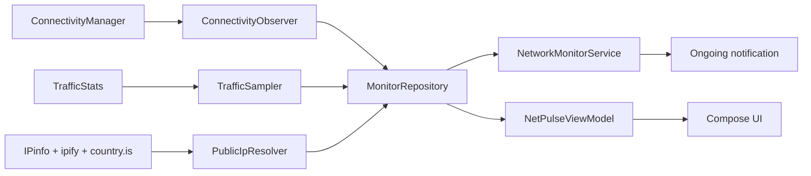

# Архитектура NetPulse

NetPulse использует один Gradle-модуль и разделение по функциям. Это сохраняет
быструю сборку небольшого приложения, не смешивая Android UI, сетевое ядро и
выпуск обновлений.

## Поток данных

`MonitorRepository` является единым источником текущего состояния. UI и
foreground service подписываются на один `StateFlow`, поэтому уведомление и
экраны не расходятся.

## Измерение скорости

На Android 12+ сначала используются счётчики логического интерфейса активной
сети. При VPN это уменьшает риск двойного подсчёта туннельного и физического
трафика. Если счётчики интерфейса недоступны, используется системный суммарный
счётчик. Смена интерфейса, перезагрузка и сброс счётчика обнуляют базовую точку.

## Обновление

1. GitHub API возвращает последний стабильный Release.
2. Приложение выбирает APK и сравнивает Semantic Version.
3. Android DownloadManager загружает файл, а приложение показывает процент и объём.
4. Состояние активной загрузки восстанавливается после перезапуска процесса.
5. Проверяются SHA-256, package name, versionCode и сертификат подписи.
6. Android показывает системное подтверждение установки.

Токены GitHub в APK не используются.
