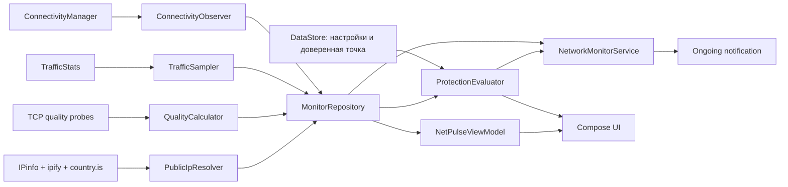

# Архитектура NetPulse

NetPulse использует один Gradle-модуль и разделение по функциям. Это сохраняет
быструю сборку небольшого приложения, не смешивая Android UI, сетевое ядро и
выпуск обновлений.

## Поток данных

`MonitorRepository` является единым источником текущего состояния. UI и
foreground service подписываются на один `StateFlow`, поэтому уведомление и
экраны не расходятся.

## Профиль защиты

`ProtectionEvaluator` является чистым Kotlin-компонентом без Android API. Он
сопоставляет текущее соединение с настройками пользователя и выдаёт одно из
трёх состояний: `PROTECTED`, `ATTENTION` или `DANGER`. Доверенная точка хранит
страну и организацию ASN, но не сохраняет историю адресов и не отправляет
профиль на сервер.

Во время обновления публичного IP сравнение с доверенной точкой приостанавливается.
Фоновое предупреждение создаётся только при переходе от подтверждённого маршрута
к несовпадающему, поэтому периодические проверки не вызывают повторные тревоги.

## Измерение скорости

На Android 12+ сначала используются счётчики логического интерфейса активной
сети. При VPN это уменьшает риск двойного подсчёта туннельного и физического
трафика. Если счётчики интерфейса недоступны, используется системный суммарный
счётчик. Смена интерфейса, перезагрузка и сброс счётчика обнуляют базовую точку.

## Качество соединения

`NetworkQualityProbe` выполняет три TCP-подключения к одному публичному узлу и
использует резервный узел только при полном отказе первого. `QualityCalculator`
преобразует результаты в задержку, джиттер, приблизительные потери и одно из
состояний `EXCELLENT`, `GOOD`, `UNSTABLE` или `UNAVAILABLE`.

Проверка запускается раз в минуту при активном экране и раз в пять минут при
выключенном. Она не загружает тестовые файлы и не измеряет пропускную способность.

## Диагностика и приватность

Диагностический отчёт формируется целиком на устройстве из текущего
`MonitorSnapshot`, настроек и последних событий. Передача начинается только
после явного выбора системной команды «Поделиться». Публичный IP и страна по
умолчанию скрыты в уведомлении на экране блокировки.

## Обновление

1. GitHub API возвращает последний стабильный Release.
2. Приложение выбирает APK и сравнивает Semantic Version.
3. Android DownloadManager загружает файл, а приложение показывает процент и объём.
4. Состояние активной загрузки восстанавливается после перезапуска процесса.
5. Проверяются SHA-256, package name, versionCode и сертификат подписи.
6. Android показывает системное подтверждение установки.

Токены GitHub в APK не используются.
